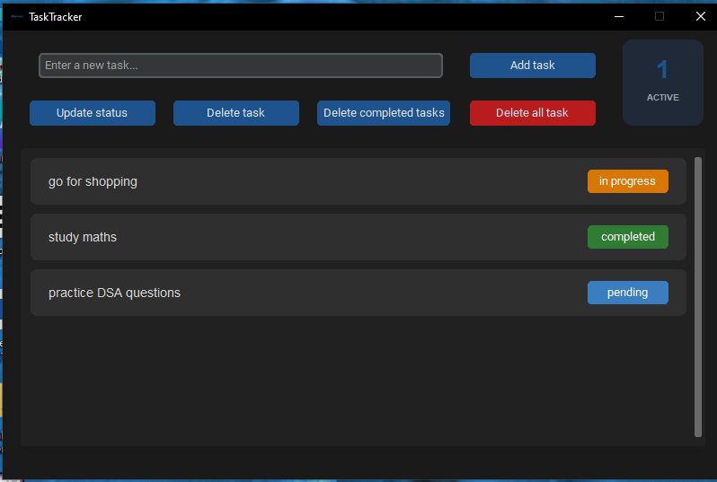

# TaskTracker

TaskTracker is a simple desktop to-do list app built with Python and CustomTkinter. It offers a polished dark-themed interface for managing tasks, updating their status, cleaning up completed tasks, and a clear widget to show how many tasks are active .

## Features

- Add new tasks quickly
- Update task status between pending, in progress, and completed
- Delete individual tasks
- Remove completed tasks in one click
- Clear the full task list safely
- Keep tasks saved locally in task.json
- Show a live count of active tasks

## Screenshots



## Installation

1. Clone the repository
```bash
git clone https://github.com/yourusername/your-repo-name.git
cd your-repo-name
```

2. (Optional but recommended) Create a virtual environment
```bash
python -m venv venv
```

Activate it:
- Windows:
```bash
venv\Scripts\activate
```
- Mac/Linux:
```bash
source venv/bin/activate
```

3. Install the required dependencies
```bash
pip install -r requirements.txt
```

4. Run the app
```bash
python app.py
```

> On first run, the app will automatically create a `task.json` file in the project folder to store your tasks locally.

## Project Structure

```text
to-do list - GUI based/
├── assets/
│   ├── logo.ico
│   ├── logo.png
│   └── screenshot.png
├── main.py
├── tasks.py
├── task.json
├── requirements.txt
├── README.md
└── LICENSE
```

## Tech Stack

- Python 3
- CustomTkinter for the modern GUI
- Pillow for handling the app icon
- JSON for local task persistence

## License

This project is licensed under the MIT License. See the LICENSE file for details.